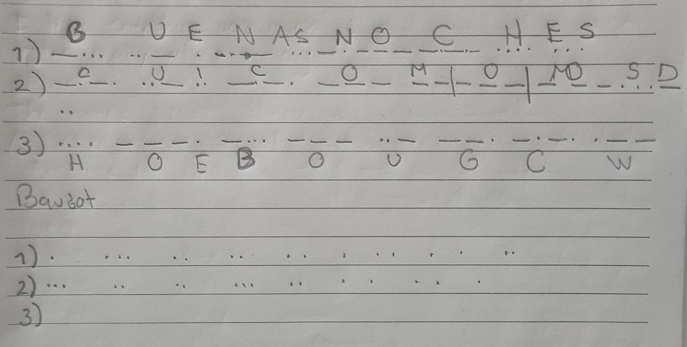
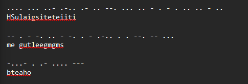
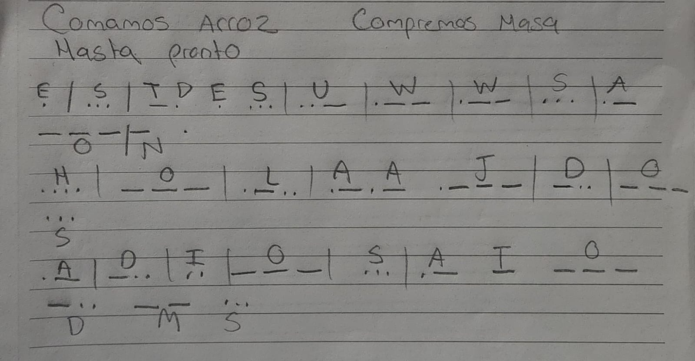
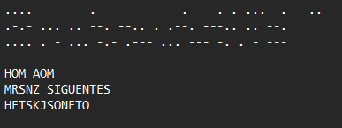

# Reporte Laboratorio 1
+ Ana Laura Tschen 221645
+ Karen Pineda 231132

## Datos de la otra pareja
+
+ 

## Preguntas

### 3.1 Transmisión de Códigos
+ **¿Qué esquema (código) fue más fácil de transmitir y por qué? ¿Qué esquema (código) fue más difícil de transmitir y por qué?**
R: El esquema de codigo más fácil de transmitir fue el Baudot, debido a que ya tenía como sus tiempos definidos. Mientras que el más difícil de transmitir fue el morse, porque dependía mucho de la persona si el tiempo para representar el dash o el punto. Si uno pulsa bastante rápido uno se pierde y se terminan juntando las letras, haciendo que no se pueda interpretar donde termina con exactitud la letra.

+ **¿Qué esquema tuvo menos errores (incluir datos que lo evidencien)?**
R: El morse tuvo menos errores, porque el Baudot es un poco más difícil de captar por los tiempos tan rápidos. 

``` 
Mensaje Original (Utilizando código Morse): Buenas noches

```
Resultado




### 3.2 Transmision empaquetada
+ **¿Qué dificultades involucra el enviar un mensaje de forma “empaquetada”?**
R: Las dificultades que involucra enviar un mensaje de forma empaquetada son el conocer bien que código se está utilizando y poder comprender bien como se representan las letras. También puede llegar a ser dificil reconocer las pausas. Este método también requiere mayor atención y tiempo para elaborar bien las codificaciones.




### 3.3 Conmutación de Mensajes
- Nota: esto lo terminaremos el fin de semana debido a que no encontramos pareja